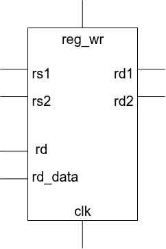

# Radiation-Hardened Register File

Design of 32×32 bit dual port register file with single event upset prevention.

---

## Deliverables

**RTL:**  
Redundant storage array and the associated majority-voting/correction logic.

**Verification:**  
Simulation logs demonstrating fault tolerance when internal bits are forced to toggle.

**Synthesis:**  
Comparitive area report against a standard, non-redundant register implementation.

---

## Problem Statement

This project implements a **32×32-bit dual-port register file** that maintains data integrity in the presence of radiation-induced **Single Event Upsets (SEU)**.

The design uses **modular redundancy** and **majority voting** to detect and correct single-bit errors in stored data.

---

## Motivation

Radiation particles in space or high-altitude environments can flip memory bits, causing **Single Event Upsets (SEU)**. These errors can lead to incorrect system behavior in satellites, spacecraft, and safety-critical electronics.

To address this issue, **radiation-hardened digital circuits** use redundancy techniques to maintain correct operation even when faults occur.

---

## Block Diagram

<p align="center">
  
</p>

### Block Diagram Description

- The **`reg_wr` module** implements a **32 × 32-bit register file**.
- It supports **two read ports and one write port** for efficient data access.
- **`rs1` and `rs2`** are read address inputs used to select two registers simultaneously.
- The selected register values are output through **`rd1` and `rd2`**.
- **`rd`** specifies the register address where data will be written.
- **`rd_data`** is the input data that will be stored in the selected register.
- The **write operation is controlled by the clock signal (`clk`)**, ensuring synchronous updates.
- This architecture allows **parallel read operations and controlled write operations** within the register file.

---

## Architecture

To protect against **Single Event Upsets (SEU)**, the design implements **Triple Modular Redundancy (TMR)**.

Three identical register files are instantiated:

- RF_A  
- RF_B  
- RF_C  

All write operations update the three copies simultaneously.

During read operations, the outputs of the three register files are passed to a **majority voter**, which selects the correct value based on majority agreement.

---

## Majority Voter

The majority voter compares the outputs of the three redundant register files.

For each bit position:

- If two or more copies match, that value is selected as the correct output.
- If one copy is corrupted due to SEU, the other two correct copies determine the final output.

Example:

```
RF_A = 1011
RF_B = 1011
RF_C = 1001 (bit flipped)

Majority Output = 1011
```

---

## SEU Fault Tolerance

Single Event Upsets (SEU) occur when radiation particles flip stored memory bits.

In this design:

- Data is stored in **three redundant register files**.
- A **majority voter** masks the incorrect value from the corrupted copy.
- Correct data is still delivered to the output.

This ensures reliable operation even when radiation-induced faults occur.

---

## Modules

**reg.sv**

Implements the base **32×32 dual-port register file**.  
It supports two simultaneous read operations and one synchronous write operation using the clock signal.

**hard_reg.sv**

Implements the **radiation-hardened register file using redundancy**.  
This module instantiates multiple copies of the register file and applies **majority voting** to protect against **Single Event Upsets (SEU)**.

---

# Procedure to Run the Design

## 1. Clone the Repository

```bash
git clone https://github.com/srirams2204/Radiation-Hardened-Register-File.git
cd srirams2204/Radiation-Hardened-Register-File
```

---

# RTL Simulation (Verification)

RTL simulation is performed to verify the functionality of the radiation-hardened register file and demonstrate tolerance against **Single Event Upsets (SEU)**.

## Steps

### 1. Compile the RTL files

```bash
vcs -sverilog rtl/reg.sv rtl/hard_reg.sv tb/testbench.sv
```

### 2. Run the simulation

```bash
./simv
```

### 3. Open waveform to observe register behavior

```bash
verdi -ssf wave.fsdb -nologo
```

---

## Expected Result

- Data is written to the register file correctly.
- Two registers can be read simultaneously.
- When a bit flip is injected in one redundant register copy, the **majority voter masks the error**, producing the correct output.

---

# Synthesis (Using Synopsys Design Compiler)

Synthesis converts the RTL design into a **gate-level netlist** and generates **area reports**.

## Steps

### 1. Launch Design Compiler

```bash
dc_shell
```

### 2. Run the synthesis script

```tcl
source synth.tcl
```

Typical synthesis script includes:

- Reading RTL files
- Setting technology library
- Applying constraints
- Compiling the design
- Generating reports

Example commands:

```tcl
read_file -format sverilog rtl/reg.sv
read_file -format sverilog rtl/hard_reg.sv
elaborate hard_reg
compile
report_area
report_timing
```

---

# Comparing Standard vs Radiation-Hardened Design

To analyze the overhead introduced by redundancy, both the **standard register file** and the **radiation-hardened design** are synthesized and compared.

## Steps

1. Synthesize **`reg.sv`** (standard register file).  
2. Synthesize **`hard_reg.sv`** (radiation-hardened register file).  
3. Generate the synthesis reports using **Synopsys Design Compiler**.  
4. Compare the **area reports** of both designs.

---

## Expected Observations

- The **radiation-hardened design** consumes more area due to redundant register file copies.
- Additional logic is required to implement the **majority voting mechanism**.
- Despite the area overhead, the design provides **fault tolerance against Single Event Upsets (SEU)**, ensuring reliable operation in radiation-prone environments.
# Results 
## Timing Report

<div align="center">

| Parameter | Value |
|----------|-------|
| Clock Period | 5 ns |
| Data Required Time | 4.20 ns |
| Data Arrival Time | -1.54 ns |
| Slack | 2.66 ns |
| Hold Violations | 0 |

</div>

---

## Area Report

<div align="center">

| Parameter | Value |
|----------|-------|
| Ports | 113 |
| Nets | 3631 |
| Cells | 3582 |
| Total Cell Area | 13007.852587 µm² |
| Total Area | 18347.801939 µm² |

</div>

---

## Power Report

<div align="center">

| Parameter | Value |
|----------|-------|
| Internal Power | 735.8311 µW |
| Switching Power | 6.2854 µW |
| Leakage Power | 2.8275 × 10⁻⁷ pW |
| Total Power | 770.3917 µW |

</div>


